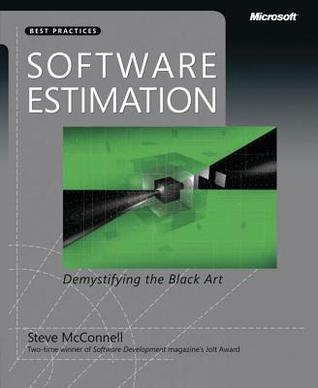
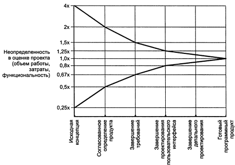
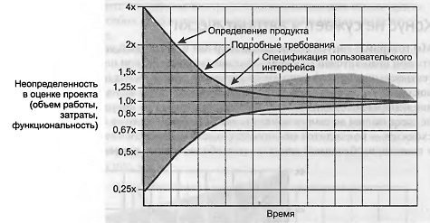
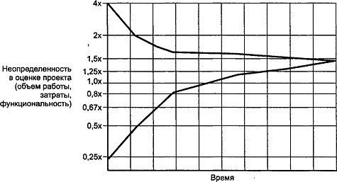
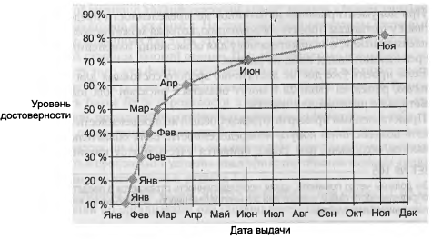

# Конспект «Software Estimation: Demystifying the Black Art»

Каждый раз, когда начальник или заказчик обсуждает новую задачу с программистами, звучит вопрос: сколько времени потребуется на разработку? Ответить на него сложно. Часто разработчики с ходу дают оценку, которая оказывается неверной и приводит к проваленным срокам.



Об этом один из главных советов Стива Макконнелла в «Software Estimation: Demystifying the Black Art»: никогда не следует давать необдуманную оценку. Лучше взять время и дать хорошую оценку, по которой разработка будет спланирована более реалистично. В книге Макконнелл рассказывает, как правильно оценивать сроки и стоимость разработки и как обсуждать эти оценки. Некоторые из его идей я пересказываю ниже в своем конспекте.

Техники из «Software Estimation» рассчитаны скорее на небольшие и средние проекты. Оценке крупных проектов объемом в сотни человеко-лет посвящены более серьезные книги и статьи в научных журналах.

Хотя знания из книги полезны, организация материала оставляет такое же ощущение, как плохой код, который хочется взять и отрефакторить. Макконнелл представляет все техники как самостоятельные методы оценки, но иногда они бывают только одной составляющей процесса, и ему приходится делать отсылки к предыдущим и последующим главам. Требуется приложить усилия, чтобы понять, как применять описанное, и представить себе процесс оценки полностью. Я в конспекте изменил последовательность изложения на ту, которая мне показалась более естественной.


## Определение оценки
Не путайте оценки, цели и обязательства:

**Оценка** — прогноз затрат времени или денег. (Проект с большой вероятностью может быть завершен в июне-июле.)
**Цель** — сформулированная бизнес-задача. (Программу нужно показать на выставке 1 сентября.)


**Обязательство** — обещание предоставить функциональность с заданным качеством к конкретной дате. (Проект будет сдан не позже 1 августа.)
Желаемые цели могут быть недостижимы, а взятые обязательства — включать запас времени или не укладываться в оценку. Результатом оценки должен быть точный прогноз, а не соответствие целям и обязательствам. По этой же причине следует разделять оценку и планирование, цель которого — достижение заданного результата, а не получение объективной информации о стоимости проекта.

Смешивание оценок, целей, обязательств и планов часто становится причиной конфликтов.

Хорошая оценка должна нести пользу. Иногда начальству важнее узнать не то, что заданный объем задач в нужный срок выполнить невозможно, а то, что проект можно завершить в нужный срок, если изменить объем задач.

Когда цель и оценка расходятся в пределах 20%, руководитель проекта может достичь цели, меняя набор функциональности, размер группы, сроки и так далее. Если расхождение больше, незначительные изменения не помогут.

## Вероятностные оценки
Точечная оценка (около двадцати недель) дает мало информации. Неясно, насколько вероятно получить такой результат. Лучше, чтобы оценка содержала вероятность (20 недель с вероятностью 70%) или выражалась в виде диапазона (от 16 недель в лучшем случае до 24 в худшем).

При этом оценщики обычно испытывают желание сузить диапазоны. Диапазоны с вероятностью 90% оказываются верными только в 60% случаев. Поэтому не стоит указывать вероятность оценки, если ее не подкрепляют численные методы.

При отсутствии явного указания диапазона в расчет будет браться четкость (precision), то есть количество значащих цифр. «1 год», «4 квартала», «13 месяцев», «392 дней» — одна оценка в разных форматах воспринимается по-разному. Поэтому четкость оценки должна соответствовать точности.

## Точность оценки
Есть два вида ошибок оценки — переоценка и недооценка.

### Опасность переоценки:

Закон Паркинсона — работа занимает всё отведенное время.
«Студенческий синдром» Голдратта — разработчики работают спустя рукава, а в конце начинается аврал.
Опасность недооценки:

Снижается эффективность планирования. Из-за недооценки можно ошибиться с размером группы или заставить одну группу простаивать в ожидании другой.
Уменьшается время, отводимое на постановку требований и проектирование. Плохая архитектура еще больше затягивает работу.
При переходе проекта в состояние «опоздания» приходится тратить время на дополнительные действия — встречи с начальством для обсуждения хода работы, подготовку новых оценок, общение с клиентами по поводу нарушения срока поставки, решение проблем с «костылями», вставленными из-за поджимающих сроков.
Потери от закона Паркинсона линейны и ограничены — работа занимает всё отведенное время, но не более. Потери от недооценки нелинейны и неограничены, их нельзя предсказать.

Но хотя переоценка и не так опасна, как недооценка, нужно стремиться к точности. Преимущества точной оценки:

Состояние проекта можно отслеживать, сравнивая оценку и текущй результат.
Не появляются ошибки и костыли из-за приближения дедлайна.
Улучшается координация разработки с тестированием, документированием, маркетингом и другими видами деятельности.
Увеличивается точность оценки бюджета.
Повышается доверие к группе разработчиков.
Появляется возможность заранее принять корректировочные меры при несоответствии оценки и целей. (Надо сделать за четыре месяца, а возможно только за шесть ⇒ урезаем функциональность.)


### Источники ошибок оценки
Неопределенность в требуемой функциональности. По мере продвижения работы над проектом неопределенность уменьшается, и оценка улучшается. Это называется конусом неопределенности.



Конус неопределенности отражает лучшую оценку, которую можно получить на этом этапе. Реальная оценка может быть только менее точной.

Единственный способ сокращения неопределенности в оценке — сокращение ее в проекте. Сжатие конуса происходит благодаря принятию решений.

При итеративной разработке небольшой конус появляется в начале каждой итерации.

**Нестабильные требования.** Они не дают конусу сузиться. При изменении требований на поздней стадии конус становится таким:



Нельзя оставлять оценку прежней, если требования меняются.

Если требования меняются постоянно, нужно менять методологию управления, а не улучшать оценку.

Можно заложить какое-то количество изменений в требованиях. Конус неопределенности с учетом 50%-ного роста требований:




**Плохое управление процессом разработки.** Слабый анализ требований, плохое проектирование, недостаточная квалификация работников и так далее. Невозможно точно оценивать процесс, который нельзя контролировать. Важнее избавиться от хаоса в управлении, чем улучшать оценку.

**Неучтенные задачи.** Их три вида:

неучтенные функциональные и нефункциональные требования (программа-установщик, обеспечение безопасности);
неучтенные действия по разработке (настройка системы сборки, исправление багов);
неучтенные действия, не связанные с разработкой (болезни, решение технических проблем).
В книге есть большой список задач каждого вида. Использование его в качестве чеклиста улучшает оценку.

**Необоснованный оптимизм.** Оценки разработчиков обычно содержат допуск на оптимизм от 20% до 30%.

**Субъективность.** Часто на оценщиков давят, чтобы оценки соответствовали целям бизнеса.

### Этапы оценки
Процесс оценки состоит из следующих этапов:

Декомпозиция проекта на части.
Оценка каждой части в промежуточных показателях (пункты ТЗ, строки кода).
Переход к непосредственным показателям (времени, срокам или стоимости).
Для экономии времени можно положиться на экспертную оценку и пропустить первый или второй этап — оценивать сразу весь проект или сразу в человеко-днях. Но это даст менее точный результат.

### Декомпозиция
Декомпозиция — это разделение оценки на фрагменты, и оценка фрагментов по отдельности. Размер фрагментов зависит от этапа работы над проектом: чем дальше, тем они могут быть меньше.

[Work breakdown structure](http://en.wikipedia.org/wiki/Work_breakdown_structure) — подход к декомпозиции работы.

Завышения и занижения отдельных оценок компенсируют друг друга в итоговой общей оценке.

При получении сводной оценки вычисляются оценки лучшего и худшего случаев. Формулы для получения этих оценок с различной достоверностью приведены в книге.

### Оценка в промежуточных показателях
Выбранные промежуточные показатели должны высоко коррелировать с размером проекта. Это могут быть требования, пользовательские истории, функциональные пункты, страницы сайта, диалоговые окна, таблицы БД, стандартные компоненты и так далее.

Хорошо, если показатель доступен на раннем этапе работы над проектом, — тогда его можно сразу взять и использовать, а не оценивать.

Показатели могут быть и абстрактными. Например, это может быть условный размер фрагмента — «очень малый», «малый», «средний», «большой», «очень большой». При этом смежные категории должны отличаться как минимум вдвое. Сюда же относятся абстрактные рейтинги, используемые в планировочном покере.

### Переход к непосредственным показателям
Для преобразования опосредованных показателей (количество требований) в оценку нужны соответствующие данные (время реализации одного требования). Могут использоваться:

Среднеотраслевые данные — данные других организаций по аналогичным проектам.
Исторические данные — данные организации по прошлым проектам.
Проектные данные — данные, полученные ранее в ходе оцениваемого проекта.
Исторические данные конкретной организации повышают точность благодаря учету организационных факторов. Среднеотраслевые данные следует применять только когда их нет.

Проще всего собирать исторические данные по проекту (размер проекта, объем работы, время, баги) в процессе работы над ним. Данные текущего проекта также помогут отследить динамику работы над ним и уточнить оценку на поздних этапах.

При сборе данных требуется принять некоторые решения (учитывать ли комментарии в коде? учитывать ли праздничные выходные дни?). Само решение ни на что не влияет. Главное, чтобы при сборе для всех проектов использовался общий подход, а оценщики понимали этот подход. Например, если при сборе не учитывается большое количество сверхурочной работы, в следующие проекты тоже будут автоматически заложены овертаймы.

По [закону Брукса](https://ru.wikipedia.org/wiki/%D0%9C%D0%B8%D1%84%D0%B8%D1%87%D0%B5%D1%81%D0%BA%D0%B8%D0%B9_%D1%87%D0%B5%D0%BB%D0%BE%D0%B2%D0%B5%D0%BA%D0%BE-%D0%BC%D0%B5%D1%81%D1%8F%D1%86), с ростом размера проекта объем работы растет нелинейно. Поэтому нельзя использовать данные значительно больших или меньших по размеру проектов.

### Индивидуальные экспертные оценки
Для оценки компонентов программы как в промежуточных, так и в непосредственных показателях могут применяться индивидуальные экспертные оценки. Для этого используется [методика PERT](https://en.wikipedia.org/wiki/Program_evaluation_and_review_technique).

Эксперт дает для каждого компонета оценки для лучшего, наиболее вероятного и худшего случая. Согласно PERT, ожидаемый результат вычисляется по формуле:

``` 
ОжидаемыйСлучай = [ЛучшийСлучай + (4 × НаиболееВероятныйСлучай) + ХудшийСлучай] / 6
```

Иногда используют более пессимистичный вариант:

```
ОжидаемыйСлучай = [ЛучшийСлучай + (3 × НаиболееВероятныйСлучай) + (2 × ХудшийСлучай)] / 6
```

Чтобы улучшать оценки эксперта, нужно по результатам проекта проверять, вошел ли фактический результат в предсказанный диапазон, и вычислять величину относительной ошибки (MRE):

```
MRE = [(ФактическийРезультат – ОценкаРезультата) / ФактическийРезультат] × 100%
```

### Уточнение оценки с помощью группового обсуждения
Ошибки в оценках, полученных при групповом обсуждении, в среднем в два раза меньше. Оно полезно на ранней стадии или при большом количестве факторов неопределенности.

При групповом обсуждении выполняют три правила:

Каждый оценивает по отдельности, а потом все встречаются для сравнения оценок.
Разницу между результатами надо обсудить, нельзя просто принимать среднюю оценку.
С итоговой оценкой должна согласиться вся группа.
[Широкополосный дельфийский метод](https://en.wikipedia.org/wiki/Wideband_delphi) предлагает структуру для группового обсуждения.

Групповая оценка стоит дороже индивидуальной, потому что требует собраний и работы нескольких оценщиков. Обычно достаточно 3–5 человек.

### Оценочные программы
Существуют программы, предназначенные для вычисления оценки (например, COCOMO II). Они могут лучше человека смоделировать разброс в оценке, дать вероятностный диапазон, учесть издержки масштаба, учесть непредвиденное расширение требований, вычислить плановые показатели. Программы дают возможность быстро пересчитать показатели с другими входными условиями.

Программы стоят дорого, иногда это объясняется наличием базы исторических данных. Но данные хотя бы по трем проектам, сделанным в этой же организации, гораздо полезнее.

Оценочные программы могут выдать неверный результат из-за неверных предположений, неверной калибровки, внесения смещения при помощи коэффициентов. Результат всё равно нужно проверять на соответствие здравому смыслу.

Оценку программы можно использовать для проверки в качестве одной из альтернативных оценок.

### Сравнение альтернативных оценок
Используйте несколько альтернативных методов оценки и проанализируйте совпадение или расхождение результатов.

Если результаты различаются более, чем на 5%, нужно найти источник этого различия.

### Уточнение оценки по ходу работы
Проводите повторную оценку на разных этапах проекта.

По мере продвижения работы можно переходить к более точным оценкам.

Если оценка пересчитывается в результате нарушения промежуточных сроков, новая оценка должна основываться на фактическом ходе проекта, а не на изначальном плане.

Заказчикам обычно не нравится увеличение оценки по ходу проекта. Лучше давать им оценку в виде диапазона, который будет постепенно уточняться.

### Представление оценки
Важной частью оценки являются задокументированные предположения, которые легли в ее основу. К ним относятся: обязательные и необязательные функции программы, глубина проработки функций, доступность ключевых ресурсов, зависимость от третьих сторон, основные неизвестные факторы, качество оценки, назначение оценки. Если какие-то из этих предположений не сбудутся, это станет основанием для пересмотра оценки.

Если представить оценку в виде диапазона плюс/минус, то при прохождении по организации она может превратиться в точечную, иногда с усечением до минимума.

Можно сразу квантифицировать риски — указать, как изменится оценка при нарушении каждого предположения (не получилось использовать код предыдущего проекта ⇒ +1,5 месяца).

Оценки с коэффициентом достоверности можно представить в виде графика:



### Политика: как избежать проблем из-за сроков
Часто руководство беспокоится о внешних факторах, которые требуют сдать проект в указанный срок или уложиться в заданный бюджет. Нужно понимать эти факторы и показывать понимание.

Не нужно обсуждать оценки — они являются результатом анализа и не могут измениться. Обсуждайте обязательства, принимаемые на основе оценки.

Разработчики часто беспокоятся, что высокая оценка приведет к отклонению проекта. Это нормально. Занизив оценку, они заставят руководство принять неверное решение.

В ходе переговоров можно прийти к решениям, которые позволят достичь целей без взятия нереалистичных обязательств. Это может быть исключение некоторых функций, их приоритезация, привлечение дополнительных ресурсов. Разработчик должен предложить варианты планирования, поддерживающие цели организации.

Эти варианты должны быть продуманы заранее. В процессе обсуждения не следует давать необдуманных оценок.

!!! info "Источник"
    - [Конспект «Software Estimation: Demystifying the Black Art»](http://igorshevchenko.ru/blog/entries/software-estimation)